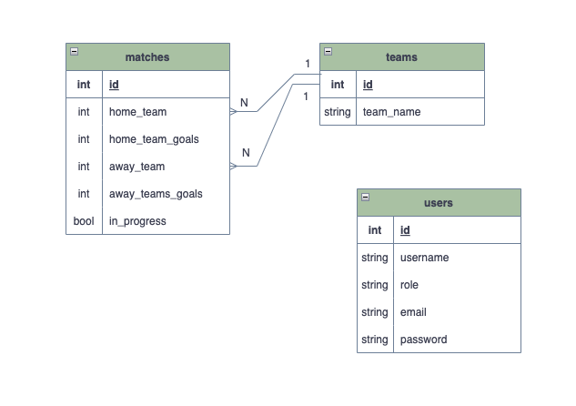

# :soccer: Trybe Football Club :soccer:

## About:
This project was developed during the Trybe development course. The project is an informative website about a soccer championship that contains both standings and match tables. The front-end provides the information which is then sent to the back-end through an API, and subsequently stored in the database. I was responsible for developing the entire back-end and database, while the front-end was developed by the Trybe team.

## Concepts:
- Database modeling; 
- RESTfull API;
- Object Oriented Programing (OOP) paradigm;
- Test-Driven Development (TDD);

## Database ER Diagram:

## Requirements:
- Endpoint POST /login:
  - The request body must have the following format:
  `{
    "email": "string",
    "password": "string"
  }`
  - Sending correct credentials, the status response will be 200, with an object containing the access token.
- Endpoint GET /login/validate
  - The status response will be 200, with an object containing the user role.
- Endpoint GET /teams
  - The status response should be 200, with the teams list, with the following object format:
  `[
  {
    "id": 1,
    "teamName": "Avaí/Kindermann"
  },
  {
    "id": 2,
    "teamName": "Bahia"
  },
  {
    "id": 3,
    "teamName": "Botafogo"
  },
  ...
]`
- Endpoint GET /teams/:id:
  - The status response should be 200, with the following object format:
  `{
  "id": 4,
  "teamName": "Corinthians"
  }`
- Endpoint GET /matches:
  - The status response should be 200, with the following object format:
  `
  [
  {
    "id": 1,
    "homeTeam": 16,
    "homeTeamGoals": 1,
    "awayTeam": 8,
    "awayTeamGoals": 1,
    "inProgress": false,
    "teamHome": {
      "teamName": "São Paulo"
    },
    "teamAway": {
      "teamName": "Grêmio"
    }
  },
  ...
  {
    "id": 41,
    "homeTeam": 16,
    "homeTeamGoals": 2,
    "awayTeam": 9,
    "awayTeamGoals": 0,
    "inProgress": true,
    "teamHome": {
      "teamName": "São Paulo"
    },
    "teamAway": {
      "teamName": "Internacional"
    }
  }
  ]
  `
- Endpoint GET /matches?inProgress=true:
  - It will show the same response as GET /matches, with a filter of in progress matches.
- Endpoint GET /matches?inProgress=false
  - It will show the same response as GET /matches, with a filter of ended matches.
- Endpoint POST /matches:
  - The request body must have the following format:
  `
  {
  "homeTeam": 16,
  "awayTeam": 8,
  "homeTeamGoals": 2,
  "awayTeamGoals": 2,
  }
  `
  - The response status should be 201, with the following object format:
  `
  {
  "id": 1,
  "homeTeam": 16,
  "homeTeamGoals": 2,
  "awayTeam": 8,
  "awayTeamGoals": 2,
  "inProgress": true,
  }
  `
- Endpoint PATCH /matches/:id/finish
  - It should change the match status to `finished` and return a 201 status, with the following message: `{ "message": "Finished" }`
- Endpoint PATCH /matches/:id
  - It should update an in progress match.
  - The request body should have the following object format: `{
  "homeTeamGoals": 3,
  "awayTeamGoals": 1
}`
  - The response status should be 200.
- Endpoint GET /leaderboard/home:
  - It should return the current standings, considering only the matches played home.
  - It should not consider in progress matches.
  - The response body format should have the following format: `
  [
  {
    "name": "Corinthians",
    "totalPoints": 9,
    "totalGames": 3,
    "totalVictories": 3,
    "totalDraws": 0,
    "totalLosses": 0,
    "goalsFavor": 9,
    "goalsOwn": 3,
    "goalsBalance": 6,
    "efficiency": "100.00"
  },
  {
    "name": "Palmeiras",
    "totalPoints": 7,
    "totalGames": 3,
    "totalVictories": 2,
    "totalDraws": 1,
    "totalLosses": 0,
    "goalsFavor": 10,
    "goalsOwn": 5,
    "goalsBalance": 5,
    "efficiency": "77.78"
  },
  {
    "name": "Santos",
    "totalPoints": 6,
    "totalGames": 2,
    "totalVictories": 2,
    "totalDraws": 0,
    "totalLosses": 0,
    "goalsFavor": 6,
    "goalsOwn": 1,
    "goalsBalance": 5,
    "efficiency": "100.00"
  },
  ...
  ]
  `
- Endpoint GET /leaderboard/away:
  - The same as GET /leaderboard/home, but considering only matches played away.
- Endpoint GET /leaderboard:
  - The same as GET /leaderboard/home, but considering both matches played home and away.
- Integration tests
- Unit tests

## Technologies:
- Node.js;
- TypeScript;
- Express;
- Sequelize;
- MySQL;
- JSON Web Token (JWT), for authentication;
- Mocha, Chai, and Sinon for tests;

## Files:
All files inside (`app/backend/src`) folder were developed by me. The others were developed by Trybe team.

## How to run the project:
1. Make sure you have docker installed with version 1.29 or higher.
2. Git clone this repository.
3. Enter the folder.
4. Run `npm run compose:up:dev`.
5. You are ready to navegate at `http://localhost:3000/`.
  
